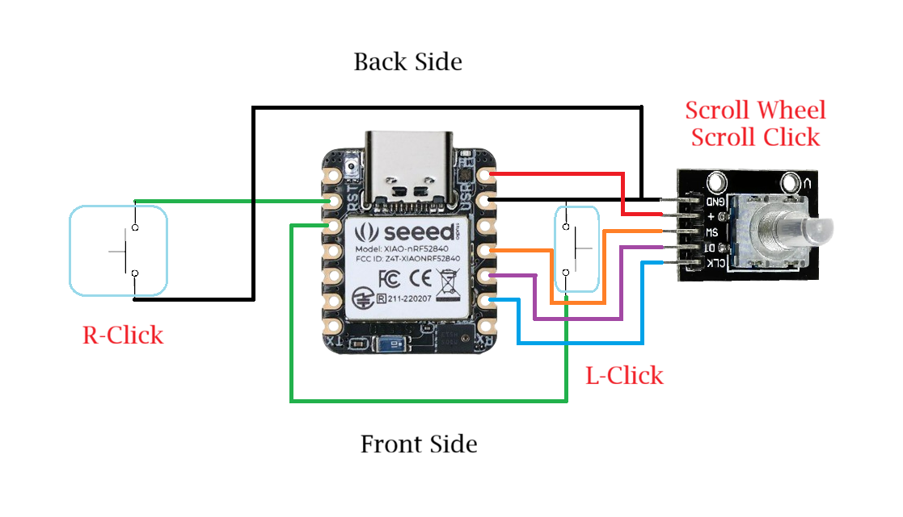

# Air-Mouse-V1-
## Air Mouse (USB/ BLE)
##### Required Components:
- Seeed Studio XIAO nRF52840 Sense
- Push Button
- Rotary Encoder

##### Required Softwares:
- Arduino IDE

##### Required libraries:
+ Seeed Studio XIAO nRF52840 Sense https://files.seeedstudio.com/arduino/package_seeeduino_boards_index.json
- LSM6DS3

## Connection Diagram

## Configuration

Download and instal Arduino IDE. Open Arduino IDE and go to files and then preferences, copy and paste the Seeed XIAO nRF52840 boards package link (Provided in the required libraries section)  in the additional boards manager url section, and click **OK**.

And download SEEED nRF52 board library.

Now download the LSM6DS3 librarie.

Now extract the zip file named firmare.zip, and open the 'Air_mouse_BLE_Wired.ino' file with Arduino IDE. connect the Seeed XIAO nRF52840 Sense board with your PC and press the 'Reset' button twice. In Arduino IDE, go to the **Tools** tab, under **Boards:** menu, inside **Seeed nRF Boards**, select "**Seeed XIAO nRF52840 Sense**".

Again go to **Tools** tab, under **Port:** select the right **COM Port** associated to your **Seeed XIAO nRF52840 Sense Board**.

Now click the **Upload** button on the top left corner of the Arduino IDE.

Immediately after uploading the firmware, the **Air Mouse** will pair with the PC in **Wired Mode**.
It needs calibration before every time you power it on.

## Calibration

Before you power on the **Air Mouse**, place it on an flat surface and then power it on. It wil automatically calibrate itself. It will just take 7-10 seconds. After calibration it will enter **Pairing Mode**, until then don't move the **Air Mouse**. 

## Pairing

After powering it on and calibration is finished it will enter **Pairing Mode**. The on-board **Red** & **Blue** LED will flash alternately.
##### Wired Mode:
- To pair the Air Mouse in wired mode, just plug in the USB data cable while it is in Pairing Mode. After pairing in wired mode the on-board **Green** LED will flash twice in every 2 Seconds.

 ##### Wireless BLE Mode:
 - To pair the Air Mouse in wireless BLE mode, power on the Air Mouse, while it's in pairing mode turn on your device Bluetooth and search for a  device named **XIAO AirMouse**, and pair the device. After pairing in wireless BLE mode the on-board **Blue** LED will flash twice in every 2 Seconds.

##### Twin Pairing Mode:
- To enter in **Twin Pairing Mode**, first pair the Air Mouse in Wireless BLE Mode with your device and the connect the Air Mouse using an USB Data cable with the same device. The Air Mouse will automatically be paired in Twin Pairing Mode. In this mode the Air Mouse is connected in wired and wireless BLE mode simultaneously, and HID priority is wired mode. In this mode, you can switch between wired & wireless mode seamlessly by just plugging in and plugging out the USB data cable. There will be no lag between HID switching.

**Do not pair the Air Mouse with two different devices in Twin Pairing Mode.**
